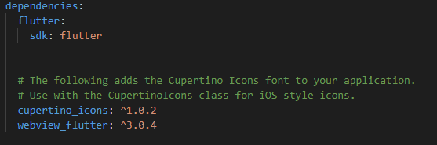

# WebView in Flutter

### 1. Menambahkan plugin webview_flutter

### 2. Menggunakan webview controller dan membuat navigasi kontrol yang dapat menavigasi maju, mundur pada histori halaman  

### 3. Membuat tombol menu di widget AppBar yang digunakan untuk mengevaluasi JavaScript, memanggil saluran JavaScript, dan mengelola cookie dan saat pengguna memilih opsi menu Buka YouTube, metode loadUrl WebViewController akan dijalankan. Navigasi ini akan diblokir oleh callback navigationDelegate yang Anda buat di langkah sebelumnya.

### 4. Mengevaluasi javascript

### 5. Mengelola cookie di WebView dengan menggunakan class CookieManager. Pada langkah ini dapat menampilkan daftar cookie, menghapus daftar cookie, menghapus cookie, dan menetapkan cookie baru.

